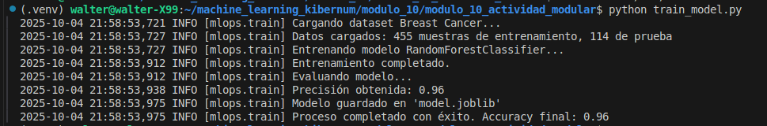
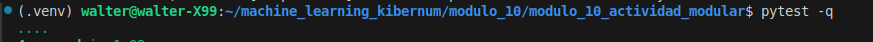
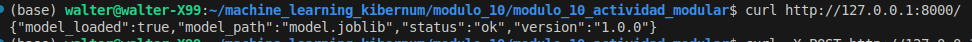
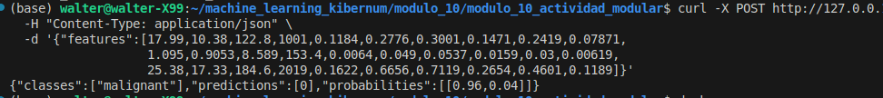
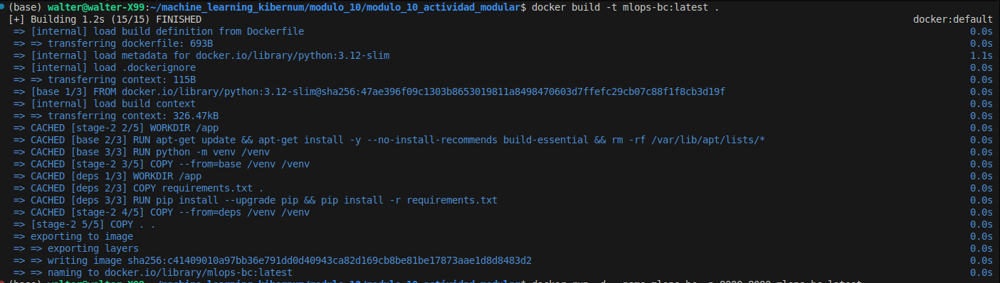
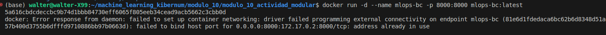
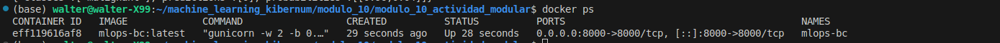

# Actividad Modular - Kibernum Academy

## MLOps / Machine Learning

### Descripción

Proyecto final del módulo 10: desarrollo completo de un flujo de
**Machine Learning**, incluyendo:

-   Entrenamiento y serialización del modelo\
-   Exposición de una **API REST** con Flask\
-   Pruebas automatizadas con `pytest`\
-   Despliegue reproducible en **Docker**

El modelo usa el dataset **Breast Cancer Wisconsin** para predecir si un
caso es *maligno* o *benigno*.

------------------------------------------------------------------------

## Estructura del proyecto

    .
    ├── app.py
    ├── train_model.py
    ├── logger.py
    ├── model.joblib
    ├── test_api.py
    ├── test_api_errors.py
    ├── requirements.txt
    ├── Dockerfile
    ├── docker-compose.yml
    ├── ping.json
    ├── predict.json
    ├── imgs/
    └── README.md

------------------------------------------------------------------------

## Instalación local

``` bash
python -m venv .venv
source .venv/bin/activate
pip install -r requirements.txt
```

------------------------------------------------------------------------

## 1️⃣ Entrenamiento del modelo

``` bash
python train_model.py
```

Genera `model.joblib` con un **RandomForestClassifier**.\
**Evidencia:**\


------------------------------------------------------------------------

## 2️⃣ Tests automatizados

``` bash
pytest -q
```

**Evidencia:**\


------------------------------------------------------------------------

## 3️⃣ Ejecución de la API local

``` bash
python app.py
```

Verifica el estado:

``` bash
curl http://127.0.0.1:8000/
```

**Evidencia:**\


------------------------------------------------------------------------

## 4️⃣ Predicción del modelo

``` bash
curl -X POST http://127.0.0.1:8000/predict   -H "Content-Type: application/json"   -d '{"features":[17.99,10.38,122.8,1001,0.1184,0.2776,0.3001,0.1471,0.2419,0.07871,
                   1.095,0.9053,8.589,153.4,0.0064,0.049,0.0537,0.0159,0.03,0.00619,
                   25.38,17.33,184.6,2019,0.1622,0.6656,0.7119,0.2654,0.4601,0.1189]}'
```

Ejemplo de respuesta:

``` json
{"classes":["malignant"],"predictions":[0],"probabilities":[[0.96,0.04]]}
```

**Evidencia:**\


------------------------------------------------------------------------

## 5️⃣ Despliegue con Docker

**Construcción de imagen:**

``` bash
docker build -t mlops-bc:latest .
```



**Ejecución del contenedor:**

``` bash
docker run -d --name mlops-bc -p 8000:8000 mlops-bc:latest
```



**Contenedor activo:**

``` bash
docker ps
```



------------------------------------------------------------------------

## Autor

**Walter M.**\
Repositorio:
[kibernum_ml_modulo_10_actividad_modular](https://github.com/walterm2482/kibernum_ml_modulo_10_actividad_modular)
